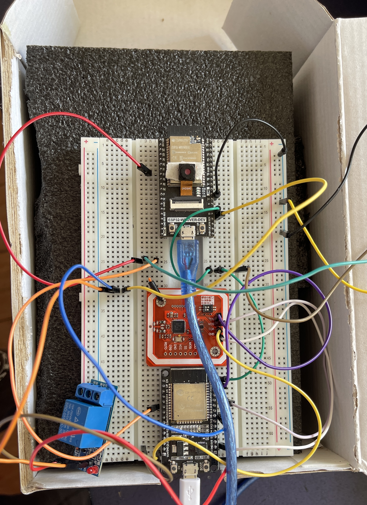

# Projeto de Controle de Acesso com NFC e Reconhecimento Facial com ESP32

## Descrição do Projeto

Este projeto implementa um sistema de controle de acesso usando duas placas ESP32. Uma das placas é responsável pela leitura de cartões NFC, enquanto a outra é utilizada para reconhecimento facial com uma câmera ESP32-CAM. Quando a câmera não reconhece a pessoa ou o cartão lido no NFC não é reconhecido, um LED vermelho é ativado. Se o reconhecimento for bem-sucedido, um buzzer de sucesso soa, um LED verde acende e um relé é acionado para abrir a fechadura.

## Estrutura do Projeto

- **NFC**: Contém o código e a configuração para a leitura de cartões NFC.
- **FaceDoorEntryESP32Cam**: Contém o código e a configuração para o reconhecimento facial com a ESP32-CAM.

## Estrutura do Circuito



É um circuito com dois ESP. Um ESP é o ESP responsável pelo NFC, que utiliza aquele que a gente já viu no REGIME ali. E esse ESP aqui é um ESP sem câmera, que é o ESP DEV KIT, que é o mais padrão utilizado. O outro ESP é o ESP-32 ROVER DEV, que tem um ESP-CAM nele. Esse circuito, quando a câmera não reconhece a pessoa ou o cartão lido no NFC não é reconhecido, a gente liga um LED vermelho. Quando é reconhecido na câmera ou quando o cartão NFC é reconhecido, ele liga um buzzer de sucesso, liga o LED verde e ativa o relay para poder abrir a fechadura do sistema.

## Parte NFC

### Funcionalidades

- **Leitura de Cartão NFC**: Utiliza o módulo Adafruit PN532 para ler cartões NFC.
- **Verificação de UID**: Compara o UID lido com um UID válido predefinido.
- **Controle de Acesso**: Controla relés para conceder ou negar acesso com base na verificação do UID.
- **Saída Serial**: Imprime informações detalhadas sobre o processo de leitura e verificação na porta serial.

### Pré-requisitos

Antes de começar, certifique-se de que você tem os seguintes componentes e softwares instalados:

#### Componentes de Hardware

- ESP32 DEV KIT
- Módulo NFC Adafruit PN532
- Relés
- Cartão NFC

#### Software

- Arduino IDE (versão 1.8.19 ou superior)
- Pacote de placas ESP32 (versão 3.0.1)
- Bibliotecas necessárias:
  - **Adafruit_PN532**
  - **Wire**

### Conexões de Hardware

- **ESP32 e Módulo NFC Adafruit PN532**:
  - `pin_sda (ESP32 GPIO 21)` -> `SDA (PN532)`
  - `pin_scl (ESP32 GPIO 22)` -> `SCL (PN532)`
- **Relés**:
  - `pinRelay (ESP32 GPIO 5)`
  - `relay_pin_sucesso (ESP32 GPIO 23)`
  - `relay_pin_negado (ESP32 GPIO 32)`

## Parte de Reconhecimento Facial

### Funcionalidades

- **Reconhecimento Facial**: Utiliza a ESP32-CAM para reconhecer rostos.
- **Controle de Acesso**: Controla relés para conceder ou negar acesso com base no reconhecimento facial.
- **Servidor Web**: Permite o treinamento e reconhecimento de rostos via interface web.

### Pré-requisitos

Antes de começar, certifique-se de que você tem os seguintes componentes e softwares instalados:

#### Componentes de Hardware

- ESP32-CAM (ESP-32 ROVER DEV)
- Relés
- LED vermelho e verde
- Buzzer

#### Software

- Arduino IDE (versão 1.8.13 ou superior)
- Pacote de placas ESP32 (versão 1.0.5)
- Bibliotecas necessárias:
  - `ArduinoWebsockets`
  - `esp_http_server`
  - `esp_timer`
  - `esp_camera`

### Configuração

#### Conexão Wi-Fi

Defina o SSID e a senha da rede Wi-Fi:

```cpp
const char* ssid = "MPS3000";
const char* password = "MPSenha2002";
```

#### Modelos de Câmera

Selecione o modelo da câmera descomentando a linha correspondente:

```cpp
#define CAMERA_MODEL_WROVER_KIT
//#define CAMERA_MODEL_ESP_EYE
//#define CAMERA_MODEL_M5STACK_PSRAM
//#define CAMERA_MODEL_M5STACK_WIDE
//#define CAMERA_MODEL_AI_THINKER
#include "camera_pins.h"
```

#### Modo de Inicialização

Defina o modo de inicialização:

```cpp
#define INICIAR_COM_WEB_SERVER 0 // 0 para iniciar offline sem precisar de internet
```

### Configuração de Hardware

- Conecte os componentes conforme necessário.
- Ajuste as configurações de Wi-Fi e modelo de câmera no código.

### Operação

1. **Carregar o Código**:
   - Abra o código na Arduino IDE.
   - Selecione a placa ESP32 correta em `Tools > Board`.
   - Conecte o ESP32 ao computador e selecione a porta correta em `Tools > Port`.
   - Carregue o código para o ESP32.

2. **Monitorar o Serial**:
   - Abra o Monitor Serial na Arduino IDE para visualizar as mensagens do sistema.
   - Certifique-se de que a taxa de baud está configurada para 115200.

3. **Testar o Sistema**:
   - Para treinamento e reconhecimento de rostos, inicie com `INICIAR_COM_WEB_SERVER` configurado como 1.
   - Para apenas reconhecimento (depois de ter treinado os rostos), configure `INICIAR_COM_WEB_SERVER` como 0.
   - Acesse o servidor web via IP fornecido no Serial Monitor para treinar novos rostos.
   - O sistema abrirá a porta automaticamente quando um rosto conhecido for reconhecido.

---

### Explicação dos Métodos

#### `do_enrollment`

```cpp
static inline int do_enrollment(face_id_name_list *face_list, dl_matrix3d_t *new_id)
{
  ESP_LOGD(TAG, "START ENROLLING");
  int left_sample_face = enroll_face_id_to_flash_with_name(face_list, new_id, st_name.enroll_name);
  ESP_LOGD(TAG, "Face ID %s Enrollment: Sample %d",
           st_name.enroll_name,
           ENROLL_CONFIRM_TIMES - left_sample_face);
  return left_sample_face;
}
```
Este método é responsável por inscrever um novo rosto na lista de rostos reconhecidos. Ele grava o ID do rosto na memória flash e retorna o número de amostras restantes necessárias para completar o processo de inscrição.

#### `app_facenet_main`

```cpp
void app_facenet_main()
{
  face_id_name_init(&st_face_list, FACE_ID_SAVE_NUMBER, ENROLL_CONFIRM_TIMES);
  aligned_face = dl_matrix3du_alloc(1, FACE_WIDTH, FACE_HEIGHT, 3);
  read_face_id_from_flash_with_name(&st_face_list);
}
```
Este método inicializa a lista de nomes e IDs de rostos, aloca memória para alinhar as imagens dos rostos e lê os IDs de rostos armazenados na memória flash.

#### `app_mtmn_config`

```cpp
static inline mtmn_config_t app_mtmn_config()
{
  mtmn_config_t mtmn_config = {0};
  mtmn_config.type = FAST;
  mtmn_config.min_face = 80;
  mtmn_config.pyramid = 0.707;
  mtmn_config.pyramid_times = 4;
  mtmn_config.p_threshold.score = 0.6;
  mtmn_config.p_threshold.nms = 0.7;
  mtmn_config.p_threshold.candidate_number = 20;
  mtmn_config.r_threshold.score = 0.7;
  mtmn_config.r_threshold.nms = 0.7;
  mtmn_config.r_threshold.candidate_number = 10;
  mtmn_config.o_threshold.score = 0.7;
  mtmn_config.o_threshold.nms = 0.7;
  mtmn_config.o_threshold.candidate_number = 1;
  return mtmn_config;
}
```
Este método configura os parâmetros do modelo de detecção de rostos (mtmn) usados para identificar rostos nas imagens capturadas pela câmera.

#### `handle_message`

```cpp
void handle_message(WebsocketsClient &client, WebsocketsMessage msg)
{
  if (msg.data() == "stream") {
    g_state = START_STREAM;
    client.send("STREAMING");
  }
  if (msg.data() == "detect") {
    g_state = START_DETECT;
    client.send("DETECTING");
  }
  if (msg.data().substring(0, 8) == "capture:") {
    g_state = START_ENROLL;
    char person[FACE_ID_SAVE_NUMBER * ENROLL_NAME_LEN] = {0,};
    msg.data().substring(8).toCharArray(person, sizeof(person));
    memcpy(st_name.enroll_name, person, strlen(person) + 1);
    client.send("CAPTURING");
  }
  if (msg.data() == "recognise") {
    g_state = START_RECOGNITION;
    client

.send("RECOGNISING");
  }
  if (msg.data().substring(0, 7) == "remove:") {
    char person[ENROLL_NAME_LEN * FACE_ID_SAVE_NUMBER];
    msg.data().substring(7).toCharArray(person, sizeof(person));
    delete_face_id_in_flash_with_name(&st_face_list, person);
    send_face_list(client); // reset faces in the browser
  }
  if (msg.data() == "delete_all") {
    delete_all_faces(client);
  }
}
```
Este método manipula mensagens recebidas via WebSockets. Ele altera o estado do sistema com base nas mensagens recebidas, como iniciar transmissão, detectar rostos, capturar rostos para inscrição, reconhecer rostos e remover ou deletar todos os rostos.

#### `open_door`

```cpp
void open_door(WebsocketsClient &client) {
  if (digitalRead(led_verde_e_buzzer) == LOW) {
    digitalWrite(led_verde_e_buzzer, HIGH); //close (energise) relay so door unlocks
    digitalWrite(pin_relay, LOW); //close (energise) relay so door unlocks
    Serial.println("Door Unlocked");
    client.send("door_open");
    door_opened_millis = millis(); // time relay closed and door opened
    digitalWrite(led_vermelho, LOW); 
  }
}
```
Este método é responsável por abrir a porta quando um rosto é reconhecido. Ele ativa o relé e o buzzer verde, envia uma mensagem ao cliente WebSocket e registra o tempo em que a porta foi aberta.

#### `open_door_sem_client`

```cpp
void open_door_sem_client() {
  if (digitalRead(led_verde_e_buzzer) == LOW) {
    digitalWrite(led_verde_e_buzzer, HIGH); //close (energise) relay so door unlocks
    digitalWrite(pin_relay, LOW); 
    Serial.println("Door Unlocked");
    door_opened_millis = millis(); // time relay closed and door opened
    digitalWrite(led_vermelho, LOW); 
  }
}
```
Este método é similar ao `open_door`, mas é usado quando o reconhecimento é feito sem a utilização de um cliente WebSocket. Ele também ativa o relé e o buzzer verde, registra o tempo em que a porta foi aberta e desativa o LED vermelho.

---

Este projeto utiliza as bibliotecas `ArduinoWebsockets`, `esp_http_server`, `esp_timer` e `esp_camera` para implementar um sistema de controle de acesso completo e funcional com ESP32.
